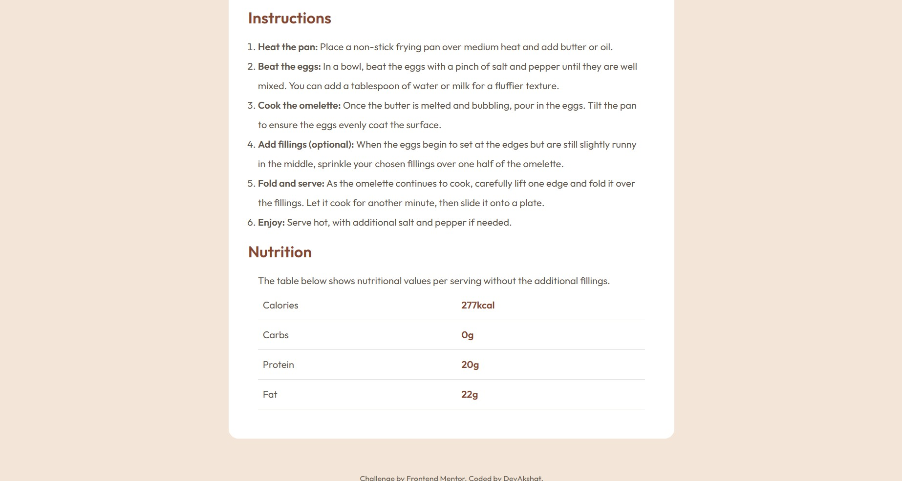

# Frontend Mentor - Recipe page solution

This is a solution to the [Recipe page challenge on Frontend Mentor](https://www.frontendmentor.io/challenges/recipe-page-KiTsR8QQKm). Frontend Mentor challenges help you improve your coding skills by building realistic projects.

## Table of contents

- [Overview](#overview)
  - [Screenshot](#screenshot)
  - [Links](#links)
- [My process](#my-process)
  - [Built with](#built-with)
  - [What I learned](#what-i-learned)
  - [Continued development](#continued-development)
  - [Useful resources](#useful-resources)
- [Author](#author)

## Overview

### Screenshot

### Links

- Solution URL: [Github Repo ((https://github.com/DevAkshat21/social-links-profile-main))]
- Live Site URL: [Live Site((https://devakshat21.github.io/social-links-profile-main/))]

## My process

Was easy and now i am able to solve these challenges very easily

### Built with

- Semantic HTML5 markup
- CSS custom properties
- Flexbox

### What I learned

Finally learned and mastered flex now i am confident in it

then also about the hover and also the border width of different sides to be different

### Continued development

Now it time to conqure something else and move to the next step

## Author

- Website - [DevAkshat](https://github.com/DevAkshat21)
- Frontend Mentor - [@DevAkshat](https://www.frontendmentor.io/profile/DevAkshat)
